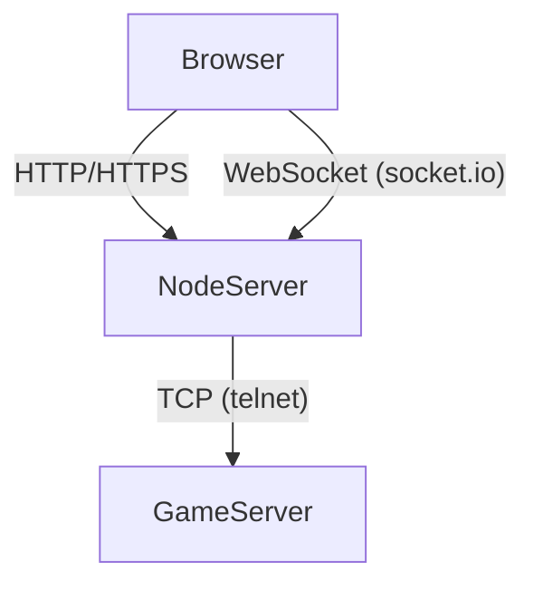
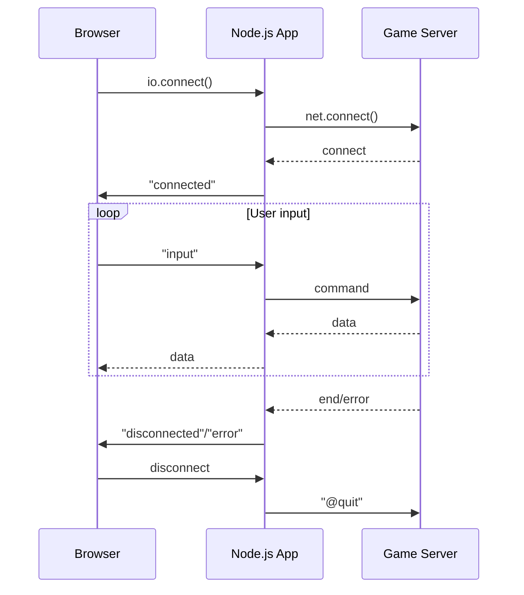

# System Architecture

This document provides an overview of how the web client interacts with the game and describes the lifecycle of the socket connections.

## Overview
The application is a Node.js server that serves static assets and bridges WebSocket connections from browsers to a text-based game running over a standard TCP connection.

- **Browser**: Loads the client UI from the Node server and uses `socket.io` to connect back.
- **Node server** (`client-app.js`): Hosts HTTP/HTTPS endpoints using Express and manages Socket.IO connections.
- **Game server**: A MUD/MOO server accepting plain TCP connections.

The server reads configuration from environment variables (see `.env-example`) such as `SOCKET_URL`, `SOCKET_URL_SSL`, `GAME_HOST` and `GAME_PORT`.

## Component Diagram

## Socket Lifecycle
The front‑end JavaScript builds a socket using `io.connect()` (see `public/js/client-src/g-socket-lifecycle.js`). On the server side a matching Socket.IO handler in `routes/socket.js` opens a TCP connection to the game.

The browser may attempt to reconnect automatically if the connection drops. When the user closes the page or the game ends, `@quit` is sent and both sockets are closed.

